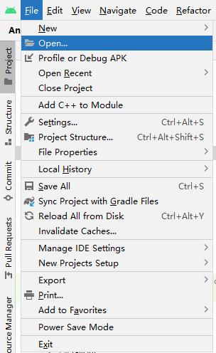
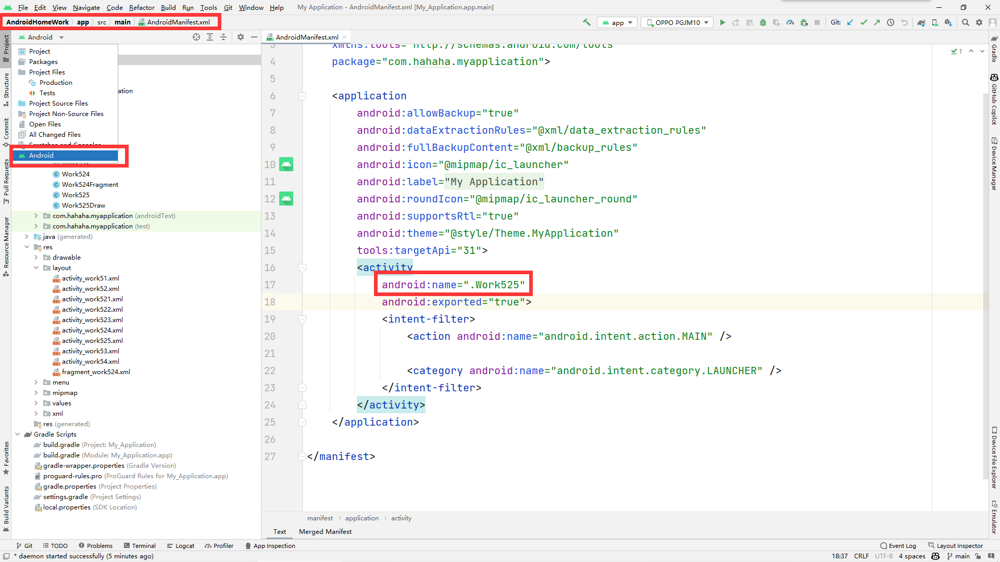
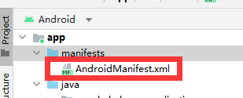
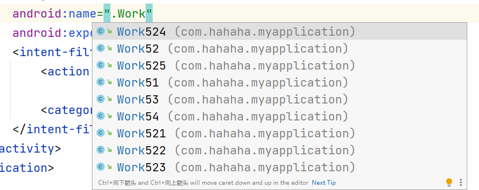
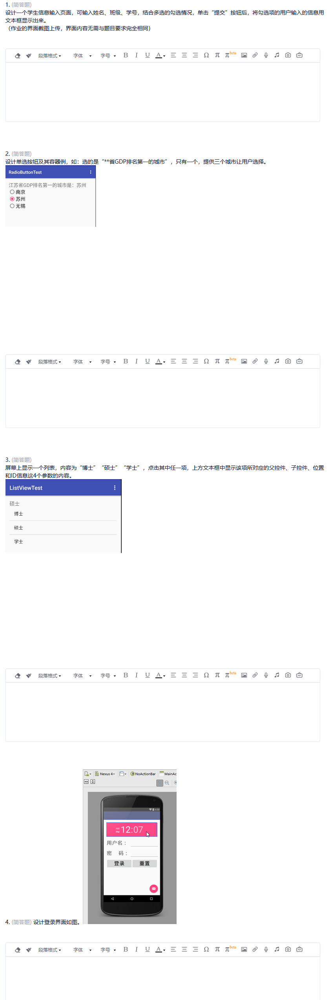
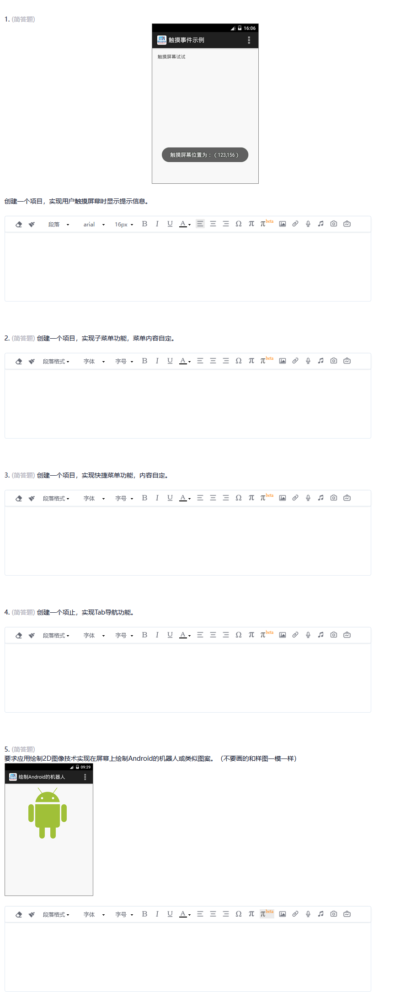

# AndroidHomeWork
 《移动平台程序设计》的作业

# 如何使用

1. 首先，下载下来

2. 打开android stdio接下来

3. 打开你下载出来的文件，你会发现这个有一个机器人图标，这是因为android stdio识别到了，打开它

4. 
  
   请确认以上几个红框，如果没错，你应该打开这个文件，看到如下界面
  5.

  这些全都是可以执行的界面，更换不同的界面，调试出来的就是什么界面，至此完成

## Work51-Work54

- 

## Work521-Work525

- 

  
